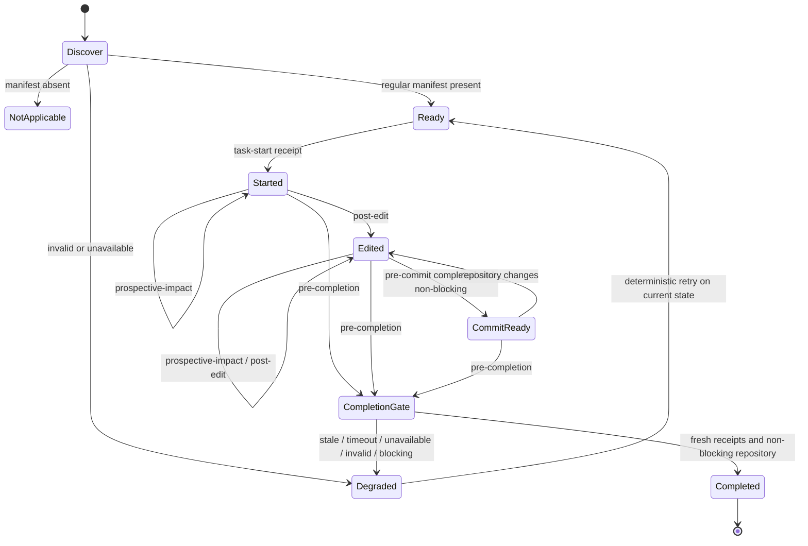

# Portable agent activation lifecycle

This document defines version 1 of the portable Murlocs activation contract. The key words
**MUST**, **MUST NOT**, **REQUIRED**, **SHOULD**, and **MAY** are normative.

The contract tells an agent host, Git integration, or generated-guidance fallback *when* to invoke
Murlocs. It does not grant authority to edit guidance, authenticate an actor, run a model, use the
network, or execute a command registered in the repository manifest. Issue #60 supplies the
versioned outcome and finding sidecar; this lifecycle owns invocation, freshness, caching, and
authority boundaries.

## Discovery and versioning

Starting from the repository root already selected by the host, an integration MUST test exactly
`.murlocs/manifest.toml`. It MUST NOT search arbitrary files, walk parent directories, infer a
repository from an `AGENTS.md`, or import the manifest during discovery.

- A regular file at that path is the Murlocs presence signal. The integration proceeds with
  contract `io.murlocs.activation`, `schema_version` 1.
- An absent path produces execution code `MURLOCS_ACTIVATION_ABSENT`. This MAY be silent and MUST
  NOT trigger installation or repository writes.
- A symlink, directory, unreadable file, unsupported manifest, or malformed response is invalid,
  not absence.
- Unknown response fields MUST be ignored. An unsupported lifecycle schema version MUST fail
  visibly; an integration MUST NOT guess at its meaning.
- Duplicate JSON object members are invalid at every contract boundary; parsers MUST reject rather
  than silently keep one value.

Discovery does not prove that the repository is healthy. That proof begins with `task-start`.

## Repository state and evidence receipts

Repository state is trusted adapter output, never agent input. The agent-callable wire request has
no `repository`, `state_id`, dependency token, token source label, or cache proof field. The
conformance driver shows separately injected `host_context` only so fixtures can exercise an
adapter; an adapter MUST construct it out of band and MUST reject those fields on its agent-facing
surface.

The adapter mints opaque `repository.state_id` values for the selected materialized view. A token
is deterministic and comparable only inside the same `adapter_id`, `adapter_version`, and
`session_id` scope. It need not be a portable repository hash: an adapter may use snapshot
isolation, a native generation identifier, or another deterministic mechanism. The invariant is
that equal tokens from the same scope name an observationally identical view for discovery and
`check`. Tokens from different scopes are never equal evidence. Issue #61 owns exact Git view
mechanics; issue #64 owns real adapter materialization and conformance.

`impact` may observe dependencies beyond that cheap repository snapshot. Only when an impact
operation is actually required, and only after a regular supported manifest is discovered, the
adapter mints an opaque operation-specific dependency token. The impact receipt carries
`dependency_before_id` and `dependency_after_id`. Both MUST be equal to the adapter's initial
dependency token and comparable in the same token scope. `task-start`/`check`, absent manifests,
and invalid discovery MUST NOT carry dependency fields or perform this impact-dependency probe;
their cache proofs MUST omit `impact_dependency_id`, and dependency-only races cannot make them
`STALE`. An adapter may satisfy the invariant with a stable isolated snapshot rather than
enumerating Git inputs. `docs/impact.md` defines current impact behavior; #64 tests whether an
adapter's dependency boundary is sufficient.

The integration MUST materialize the selected view before discovery. The exact manifest presence
test and every lifecycle operation MUST observe that same view. For `index`, a staged manifest
addition is present and a staged deletion is absent even when the unstaged worktree differs.

An operation receipt contains its typed operation, exit status, SHA-256 digest of the exact
structured output bytes, and the state token observed immediately before and after invocation. A
receipt is fresh only when:

1. the integration captured both tokens rather than accepting them from the active agent;
2. the before and after state tokens equal the adapter's initial token;
3. the operation completed after the last repository mutation in scope;
4. the output parsed under the declared schema; and
5. every REQUIRED operation for the event has a receipt; and
6. an impact receipt also has equal before/after dependency tokens.

The integration MUST discard results and return `MURLOCS_ACTIVATION_STALE` if repository state or
an impact dependency changes during invocation. `STALE` is reserved for that race; it is not a
cache decision. A pre-completion non-blocking result MUST carry fresh `check` and `impact`
receipts. A chat message, tool-call claim, cached earlier result, or agent-authored file cannot
satisfy that rule.

## Common request and response

A version-1 request has these fields:

| Field | Requirement | Meaning |
| --- | --- | --- |
| `contract` | required | Exact string `io.murlocs.activation`. |
| `schema_version` | required | Integer `1`. |
| `event` | required | One lifecycle event from the table below. |
| `correlation_id` | required | Caller-supplied task/run identifier, carried unchanged. Murlocs MUST NOT generate one. |
| `paths` | event-specific | Normalized candidate, edited, staged, or aggregate task paths. |
| `baseline` | event-specific | Typed Git selector or adapter snapshot identifier. |
| `deadline_ms` | optional | Positive local deadline; omission uses integration policy. |
| `enforcement` | optional | `enforcing` or `prompt-mediated`; it changes gate behavior, never Murlocs facts. |

The conformance driver injects this trusted `host_context` out of band. It is not part of the wire
request:

| Field | Requirement | Meaning |
| --- | --- | --- |
| `root` | required | Adapter-selected portable absolute root. |
| `manifest` | required | Exact relative path `.murlocs/manifest.toml`. |
| `view` | required | `worktree`, `index`, `commit`, or deterministic `filesystem` view. |
| `token_scope` | required | Adapter id, adapter version, and session id. |
| `state_id` | required | Opaque adapter-minted token for the selected view. |
| `impact_dependency_id` | impact-only | Opaque dependency token; absent when impact is not executed. |
| `manifest_identity` | cache-only | Non-null opaque identity for the supported manifest; required for a cache hit. |
| `baseline_resolution` | Git baseline-only | Immutable object format and peeled commit id resolved by the adapter. |
| `cache_offer` | optional | Adapter-owned cache id and proof; never accepted from the agent. |

Portable roots use one of these shapes:

- POSIX: `{"format":"posix","segments":[...]}`; an empty segment array denotes `/`.
- Windows drive: `{"format":"windows-drive","drive":"C","segments":[...]}` with one uppercase
  ASCII drive letter.
- Windows UNC: `{"format":"windows-unc","server":"name","share":"name","segments":[...]}`.

Every segment, server, and share is a nonempty Unicode scalar string and MUST NOT be `.`, `..`,
contain NUL, or contain a path separator. The response echoes the root exactly. #61 owns host
filesystem resolution and confinement rather than this transport contract.

Paths MUST be segment-normalized, deduplicated, and transported as data; leading dashes, spaces,
Unicode, renames, and deletions MUST NOT become shell syntax. Host-specific metadata MUST NOT alter
Murlocs semantics. Empty, absolute, repeated, `.`-containing, and `..`-containing paths are invalid.
`task-start` MUST omit `paths`. Post-edit, pre-commit, and pre-completion require nonempty paths.
Prospective-impact requires at least one of nonempty `paths` or `baseline`, and permits both. A
baseline is exactly one of `{"kind":"git-head"}`, `{"kind":"git-ref","name":"refs/..."}`,
`{"kind":"git-oid","object_format":"sha1|sha256","oid":"..."}`, or
`{"kind":"adapter-snapshot","value":"..."}`. The trusted adapter resolves HEAD and refs and
peels them to a commit. A full Git OID MUST name a commit, match its declared object format, and
equal the resolved commit OID; cache proofs use that immutable resolution. #61 owns exact Git
resolution. Option-like values, filesystem paths, untyped strings, arbitrary objects, and unknown
kinds are invalid. `deadline_ms` MUST be a positive integer. `correlation_id` MUST match
`[A-Za-z0-9][A-Za-z0-9._:-]{0,127}`. Allowed enforcement values are `enforcing` and
`prompt-mediated`; `pre-commit` requires the field even when it is prompt-mediated.
Adapter id/version/session, state, dependency, cache, and manifest identity tokens are JSON strings;
numeric lookalikes are invalid rather than coerced before validation.

A version-1 response separates event execution from repository policy:

| Field | Requirement | Meaning |
| --- | --- | --- |
| `contract`, `schema_version`, `event`, `correlation_id` | required | Echo accepted request identity unchanged. |
| `execution.status` | required | `completed`, `not_applicable`, `unavailable`, `timeout`, `invalid`, or `stale`. |
| `execution.code` | required | Stable event-level code from this specification. |
| `repository.root` | required | Echoes the exact portable root object. |
| `repository.token_scope` | required | Echoes adapter id, version, and session for token comparison. |
| `repository.blocking` | required | Repository finding state, independent of execution success; `null` when not assessed. |
| `repository.state_id` | required | State token actually observed. |
| `repository.manifest` | required | Exact presence-signal path. |
| `repository.view` | required | Echoes the exact repository view assessed. |
| `silent` | required | Whether a healthy consumer may suppress presentation. |
| `operations` | required | Ordered receipts for `check` and/or `impact`; never opaque commands. |
| `cache` | required | `miss`, `hit`, `rejected`, or `forbidden`, plus adapter cache id when present. |
| `outcome` | optional/reserved | Omitted, `null`, or an object. #60 owns its versioned contents; unknown object fields are ignored. |
| `writes` | required | Always an empty array in lifecycle version 1. |
| `fallback` | required | Ordered fallback identifiers from this specification. |
| `next_actions` | required | Typed operation objects, never command, argv, or shell strings. |
| `summary` | required | Compact deterministic human text derived from the response. |

`execution.status: completed` means Murlocs ran and parsed successfully; it does not mean the
repository is non-blocking. When execution cannot assess repository state, `repository.blocking`
is `null`, never a manufactured `false`. Execution codes are `MURLOCS_ACTIVATION_OK`,
`MURLOCS_ACTIVATION_ABSENT`, `MURLOCS_ACTIVATION_UNAVAILABLE`, `MURLOCS_ACTIVATION_TIMEOUT`,
`MURLOCS_ACTIVATION_INVALID`, and `MURLOCS_ACTIVATION_STALE`. A completed response with
`repository.blocking: false` MUST be silent-capable. Plain output MAY be empty in that case.
When present, `outcome` uses the [`io.murlocs.outcome` version 1 contract](outcome-envelope.md).
The sidecar never changes operation receipt, exit-code, blocking, silence, or freshness validation
in this outer lifecycle contract. Trusted state and impact-dependency tokens are bound only by the
integration and remain opaque within its adapter/session scope. An aggregate sidecar is valid only
for a multi-operation event whose exact required receipts were validated; finding provenance must
name only those receipt operations, and impact dependency evidence must still match.

Hosts MAY render a nonhealthy sidecar with its compact agent-facing rendering. For an
authority-required result, that rendering distinguishes the still-unattested task and agent state
from unresolved or externally evidenced owner review, says whether implementation may continue,
and names the gated boundary. Only a trusted adapter or repository integration may reconcile review
evidence; an agent message, local acknowledgement, or sidecar supplied by the agent is never review
evidence. A satisfied compact result names the reviewing owners and says the gated boundary may
proceed only while their externally evidenced review remains valid for the current state.

Each next action has `operation`, object-valued `arguments`, `effect` (`read_repository` or
`request_authority`), and `authority` (`integration`, `agent`, or `human`). Lifecycle v1 rejects
non-empty `writes`, `propose_write`, opaque command/argv/shell fields, invented fallback values, and
invented enforcement modes. A later deterministic repair is a separate,
explicitly authorized operation followed by new lifecycle evidence.

## Events

| Event | Required inputs | REQUIRED operations | Cache rule | Writes | Timeout/unavailable rule |
| --- | --- | --- | --- | --- | --- |
| `task-start` | `paths` absent; trusted view context | `check` | Trusted exact-proof hit only | none | Advisory; activate generated guidance and later hook/CI fallbacks. |
| `prospective-impact` | nonempty intended paths and/or typed baseline | `impact` | Trusted exact-proof hit only | none | Return uncertainty; missing routing MUST NOT mean `unaffected`. |
| `post-edit` | nonempty actual edited paths | `check`, then `impact` | Earlier proof rejected | none | Return uncertainty; preserve edits and defer to later gates. |
| `pre-commit` | nonempty staged paths and enforcement; trusted index view | `check`, then `impact` against that view | Trusted exact-proof hit only | none | Blocking for an enforcing hook; prompt-only adapters defer to hook/CI. |
| `pre-completion` | nonempty aggregate task paths | fresh `check`, then fresh `impact` | forbidden | none | Blocking until a fresh adapter, hook, or CI receipt exists. |

`check` and `impact` mean typed, structured, read-only Murlocs operations. Registered-check metadata
may appear in output, but activation MUST NOT execute registered commands. `impact` receives
explicit path values. A Git baseline MUST be passed as one typed data value with external diff and
text conversion disabled by Murlocs. A completed event has
exactly the operations and order in the table. A valid `impact` receipt has exit code 0; a valid
`check` receipt has exit code 0 or the documented repository-finding exit code 1. Other exit codes
are execution failures, not completed receipts.

All five events are safe to repeat. Cache is off unless the same trusted adapter supplies a proof
matching contract version, adapter id/version/session, event, ordered operations, normalized
operation inputs, a non-null manifest identity, state token, and impact dependency token when an
impact operation is required. The dependency field MUST be omitted when impact is not required.
With no cache offer or proof, the adapter records a normal miss and performs fresh work. An offered
cache with a missing or null manifest identity, an incomplete proof, or any mismatch is `rejected`
and then performs fresh operations; it is not `STALE`. A matching opaque cache id without the
complete proof is still a miss. Git baseline proof uses the immutable peeled commit id, not a mutable label.
`pre-completion` always reports `forbidden` and performs new operations even when a matching cache
entry exists.

## Normative state machine



Any repository mutation invalidates `Started`, `CommitReady`, and cached evidence for the prior
state. `Completed` is an integration decision based on receipts; Murlocs does not declare that the
agent's broader task is semantically correct.

## Normative sequence

```mermaid
sequenceDiagram
    participant H as Host / hook / CI
    participant R as Repository and Git view
    participant M as Murlocs read-only core
    participant A as Active agent
    H->>R: Test .murlocs/manifest.toml exactly
    R-->>H: Presence and integration-derived state token S0
    H->>M: task-start(wire request + trusted S0 context)
    M-->>H: check receipt bound to S0
    H-->>A: Silence when healthy; otherwise structured result
    A->>H: Intended paths
    H->>R: Capture impact dependency D0 when required
    H->>M: prospective-impact(paths + trusted S0/D0 context)
    M-->>H: impact receipt bound to S0 and D0
    A->>R: Edit repository
    H->>R: Capture S1 and actual edited paths
    H->>M: post-edit(paths + trusted S1 context)
    M-->>H: check bound to S1; impact also bound to dependency
    H-->>A: Silence or structured result
    H->>R: Materialize exact staged index state SI
    H->>M: pre-commit(staged paths + trusted SI context)
    M-->>H: check + impact receipts bound to SI
    H-->>A: Commit only if the enforcing gate passes
    A->>H: Requests completion
    H->>R: Capture current state S2 after last edit
    H->>M: pre-completion(aggregate paths + trusted S2 context), cache forbidden
    M-->>H: Fresh check + impact structured bytes
    H->>R: Confirm state is still S2
    H-->>A: Complete only with fresh receipts and non-blocking repository
```

## Fallbacks and enforcement

Fallback identifiers are ordered from nearest to latest: `generated-guidance`, `git-hook`, and
`ci`. They are capabilities, not evidence that another layer ran.

- **Generated guidance.** A generated root `AGENTS.md` SHOULD compactly signal Murlocs without
  requiring ordinary tasks to load this full specification. When no conforming host/hook receipt
  exists, it instructs the agent to obtain fresh `murlocs check` and `murlocs impact` results at
  pre-completion and state that this prompt-only evidence is not host-enforced. The agent cannot
  self-certify a conforming receipt.
- **Git hook.** Reversible pre-commit/pre-push integration MAY enforce the exact staged or outgoing
  view. It MUST preserve existing hook managers and follow this request/response contract.
- **CI.** CI MAY create fresh receipts for the checked-out revision and is the final portable
  backstop. A CI pass does not authenticate an owner decision or prove what an agent saw locally.

An unavailable executable MUST NOT trigger a network install. A timeout MUST terminate only the
Murlocs invocation, preserve repository bytes, and return `MURLOCS_ACTIVATION_TIMEOUT`. Task-start,
prospective-impact, and post-edit may continue with explicit uncertainty. Enforcing pre-commit and
pre-completion consumers MUST block; prompt-mediated consumers MUST report uncertainty and a typed
`use_fallback` next action rather than manufacturing successful execution.

An enforcing pre-commit timeout keeps the hook gate closed and offers an integration-authority
`retry` action. It MUST NOT offer CI as an immediately reachable next action. A
repository policy may define an authenticated human-authority bypass, but that explicit
`request_authority` action is not the default and CI availability alone is not a bypass.

## Authority boundaries

- **Murlocs** parses local inputs and returns deterministic facts. Lifecycle version 1 is read-only.
- **The integration** owns event timing, repository view isolation, deadlines, cache validation,
  receipt construction, and whether its boundary is enforcing or prompt-mediated.
- **The active agent** may propose paths, edit ordinary files, and respond to agent-action findings.
  It cannot mint freshness evidence, authenticate approval, widen write permission, or convert
  unavailable tooling into successful execution.
- **Git** supplies revision/index facts and transports reviewed changes. A commit or hook exit code
  is not authenticated guidance approval.
- **Humans and repository identity systems** own policy authorship, CODEOWNERS enforcement, and
  authority-required decisions. Murlocs reports routing evidence without claiming approval.

Mechanical repair is an allowlisted operation outside this lifecycle invocation, run under explicit
integration authority, followed by a new `post-edit` and fresh completion evidence. Murlocs
exposes it as the bounded `repair` operation, never as arbitrary shell text; hooks themselves stay
read-only. A Git integration must re-stage repaired paths and re-run its gate before completion.

## Concrete examples and conformance fixtures

Healthy task-start conformance-driver input. `host_context` is injected by the driver and removed
before validating the agent-callable wire fields:

```json
{
  "contract": "io.murlocs.activation",
  "schema_version": 1,
  "event": "task-start",
  "correlation_id": "local-42",
  "host_context": {
    "root": {"format": "posix", "segments": ["workspace", "repo"]},
    "token_scope": {"adapter_id": "local", "adapter_version": "1", "session_id": "run-42"},
    "manifest": ".murlocs/manifest.toml",
    "view": "worktree",
    "state_id": "sha256:1111111111111111111111111111111111111111111111111111111111111111"
  },
  "deadline_ms": 2000
}
```

Silent-capable response:

```json
{
  "contract": "io.murlocs.activation",
  "schema_version": 1,
  "event": "task-start",
  "correlation_id": "local-42",
  "execution": {"status": "completed", "code": "MURLOCS_ACTIVATION_OK"},
  "repository": {
    "root": {"format": "posix", "segments": ["workspace", "repo"]},
    "token_scope": {"adapter_id": "local", "adapter_version": "1", "session_id": "run-42"},
    "manifest": ".murlocs/manifest.toml",
    "view": "worktree",
    "state_id": "sha256:1111111111111111111111111111111111111111111111111111111111111111",
    "blocking": false
  },
  "silent": true,
  "operations": [
    {
      "operation": "check",
      "exit_code": 0,
      "output_sha256": "sha256:aaaaaaaaaaaaaaaaaaaaaaaaaaaaaaaaaaaaaaaaaaaaaaaaaaaaaaaaaaaaaaaa",
      "state_before": "sha256:1111111111111111111111111111111111111111111111111111111111111111",
      "state_after": "sha256:1111111111111111111111111111111111111111111111111111111111111111"
    }
  ],
  "cache": {"decision": "miss", "key": "activation-v1-task-start-example"},
  "outcome": null,
  "writes": [],
  "fallback": [],
  "next_actions": [],
  "summary": "Murlocs task-start checks passed."
}
```

Unavailable pre-completion is execution failure, not a repository finding:

```json
{
  "contract": "io.murlocs.activation",
  "schema_version": 1,
  "event": "pre-completion",
  "correlation_id": "local-42",
  "execution": {"status": "unavailable", "code": "MURLOCS_ACTIVATION_UNAVAILABLE"},
  "repository": {
    "root": {"format": "posix", "segments": ["workspace", "repo"]},
    "token_scope": {"adapter_id": "local", "adapter_version": "1", "session_id": "run-42"},
    "manifest": ".murlocs/manifest.toml",
    "view": "worktree",
    "state_id": "sha256:2222222222222222222222222222222222222222222222222222222222222222",
    "blocking": null
  },
  "silent": false,
  "operations": [],
  "cache": {"decision": "forbidden"},
  "outcome": null,
  "writes": [],
  "fallback": ["git-hook", "ci"],
  "next_actions": [
    {
      "operation": "use_fallback",
      "arguments": {"fallback": "git-hook"},
      "effect": "read_repository",
      "authority": "integration"
    }
  ],
  "summary": "Murlocs is unavailable; completion evidence is missing."
}
```

The machine-consumable golden cases live at
`tests/fixtures/activation-lifecycle/v1/conformance.json`. They cover every event, portable roots,
path-only and baseline-only impact, absence, unavailable and timeout behavior, exact trusted cache
proofs and mismatches, state/dependency races, and rejection of a syntactically valid state token
injected through the agent-callable wire request.
The [adapter conformance harness](adapter-conformance.md) adds versioned capability metadata and a
shared black-box suite without changing these event semantics. The `outcome` sidecar retains this
outer lifecycle contract.
